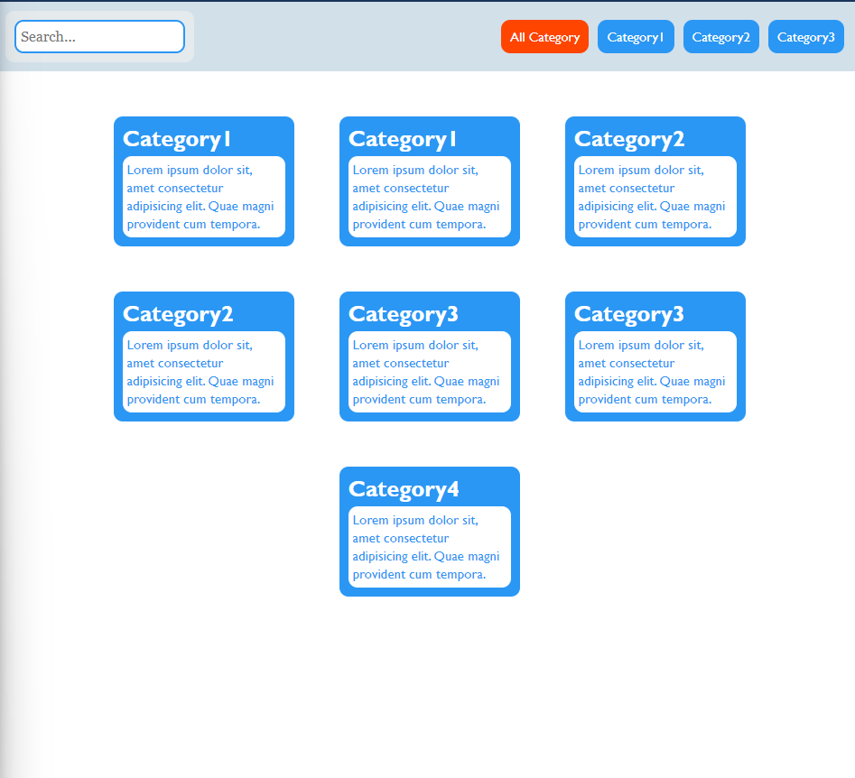
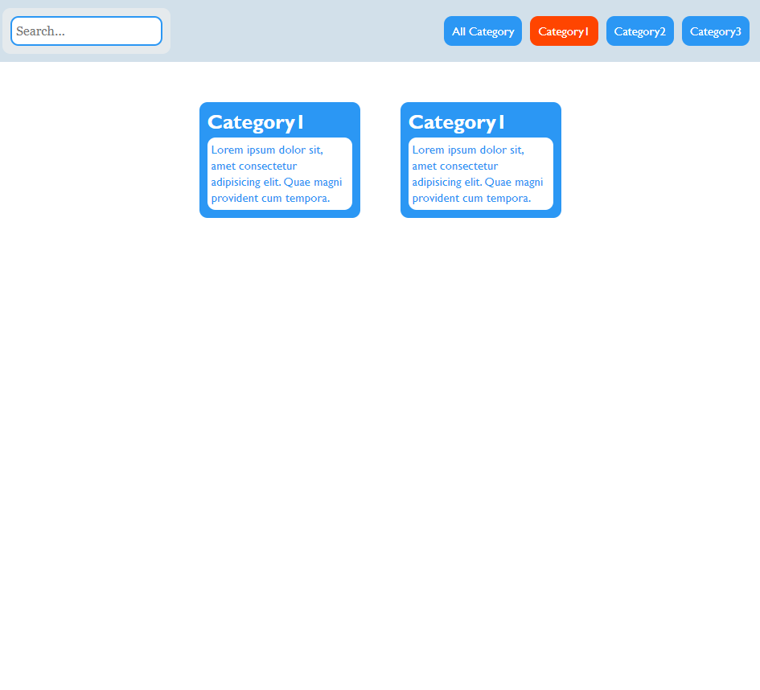
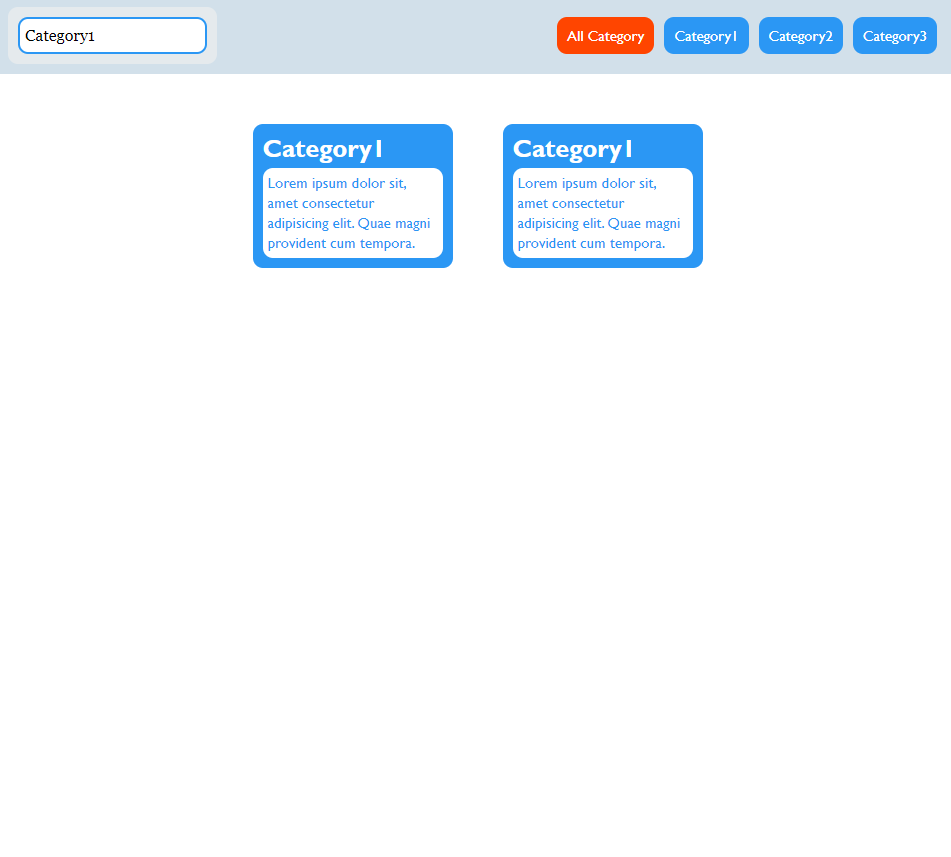

# Filter Category App

A simple **Filter Category** project using **HTML**, **CSS**, and **JavaScript**. This app allows users to filter items based on categories using both a search input and category buttons for quick navigation and filtering.

## Features

- Filter items by typing in the search bar
- Filter items by clicking on category buttons
- Clear and responsive UI
- Real-time filtering with instant feedback
- Cross-browser compatible
- Easy to expand for additional categories or filters

## Screenshots

Here are some screenshots of the filter functionality in action:

*Category Buttons Filter Example*

*Category Button Filter Example*

*Search Input Example*

## Technologies Used

- **HTML5**: Structuring the webpage and content
- **CSS3**: Styling the layout, buttons, and filters
- **JavaScript**: Implementing the filtering functionality and handling user input

## How It Works

1. **Search Filter**: Users can type into the search bar, and the list of items will dynamically filter to show only those that match the entered text.
2. **Button Filter**: Users can click one of the category buttons to filter items based on their assigned category. The active button gets highlighted to indicate the current filter.

## Usage

1. Clone or download the repository.
2. Open the `index.html` file in your web browser.
3. Interact with the search bar or category buttons to filter the displayed items.

## Customization

- You can easily add more categories by updating the HTML with new buttons and adjusting the JavaScript to handle the new categories.
- The search functionality works out-of-the-box for any text content within the items, making it simple to adapt to different use cases.

Enjoy filtering! 🎉
